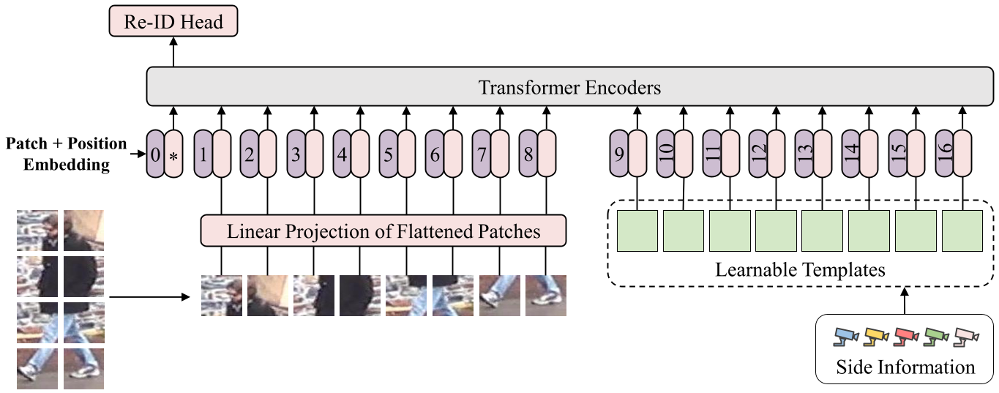

# Template-Aware Transformer for Person Reidentification

The *official* repository for [Template-Aware Transformer for Person Reidentification](https://doi.org/10.1155/2022/8917964).

## Pipeline



## Requirements

### Installation

```bash
pip install -r requirements.txt
```

We use / torch 1.7.1 / torchvision 0.8.2 / timm 0.4.12 / cuda 11.1 / 24GB RTX 3090 for training and evaluation.

Note that we use torch.cuda.amp to accelerate speed of training which requires pytorch >= 1.6.

### Prepare Datasets

Download the person datasets [Market-1501](https://drive.google.com/file/d/0B8-rUzbwVRk0c054eEozWG9COHM/view), [MSMT17](https://arxiv.org/abs/1711.08565), [DukeMTMC-reID](https://arxiv.org/abs/1609.01775), [Occluded-Duke](https://github.com/lightas/Occluded-DukeMTMC-Dataset).

Then unzip them and rename them under the directory like:

```
data
├── dukemtmcreid
│   └── images ..
├── market1501
│   └── images ..
├── MSMT17
│   └── images ..
└── Occluded_Duke
    └── images ..
```

### Prepare ViT Pre-trained Models

You need to download the ImageNet pretrained transformer model: [ViT-Base](https://github.com/rwightman/pytorch-image-models/releases/download/v0.1-vitjx/jx_vit_base_p16_224-80ecf9dd.pth).

## Training

We utilize 4 GPUs for training. You can directly train with following yml and commands:

```bash
# Market
CUDA_VISIBLE_DEVICES=0,1,2,3 python -m torch.distributed.launch --nproc_per_node=4 train.py --config_file configs/Market/vit_tat_stride_384.yml MODEL.DIST_TRAIN True SOLVER.BASE_LR 0.032

# DukeMTMC
CUDA_VISIBLE_DEVICES=0,1,2,3 python -m torch.distributed.launch --nproc_per_node=4 train.py --config_file configs/DukeMTMC/vit_tat_stride_384.yml MODEL.DIST_TRAIN True SOLVER.BASE_LR 0.032

# OCC_Duke
CUDA_VISIBLE_DEVICES=0,1,2,3 python -m torch.distributed.launch --nproc_per_node=4 train.py --config_file configs/OCC_Duke/vit_tat_stride.yml MODEL.DIST_TRAIN True SOLVER.BASE_LR 0.032

# MSMT17
CUDA_VISIBLE_DEVICES=0,1,2,3 python -m torch.distributed.launch --nproc_per_node=4 train.py --config_file configs/MSMT17/vit_tat_stride_384.yml MODEL.DIST_TRAIN True SOLVER.BASE_LR 0.032
```

## Evaluation

```bash
CUDA_VISIBLE_DEVICES=0,1,2,3 python -m torch.distributed.launch --nproc_per_node=4 test.py --config_file <file-path> TEST.WEIGHT <weight-path>
```

Some examples:

```bash
# Market
CUDA_VISIBLE_DEVICES=0,1,2,3 python -m torch.distributed.launch --nproc_per_node=4 test.py --config_file configs/Market/vit_tat_stride_384.yml TEST.WEIGHT '../logs/market_vit_tat_stride_384/transformer_120.pth'

# DukeMTMC
CUDA_VISIBLE_DEVICES=0,1,2,3 python -m torch.distributed.launch --nproc_per_node=4 test.py --config_file configs/DukeMTMC/vit_tat_stride_384.yml TEST.WEIGHT '../logs/duke_vit_tat_stride_384/transformer_120.pth'

# OCC_Duke
CUDA_VISIBLE_DEVICES=0,1,2,3 python -m torch.distributed.launch --nproc_per_node=4 test.py --config_file configs/OCC_Duke/vit_tat_stride.yml TEST.WEIGHT '../logs/occ_duke_vit_tat_stride/transformer_120.pth'

# MSMT17
CUDA_VISIBLE_DEVICES=0,1,2,3 python -m torch.distributed.launch --nproc_per_node=4 test.py --config_file configs/MSMT17/vit_tat_stride_384.yml TEST.WEIGHT '../logs/msmt17_vit_tat_stride_384/transformer_120.pth'
```

## Acknowledgement

Codebase from [TransReID](https://github.com/damo-cv/TransReID).

## Citation

Please cite this paper if it helps your research:

```bibtex
@article{zheng2022template,
  title={Template-Aware Transformer for Person Reidentification},
  author={Zheng, Yanwei and Zhao, Zengrui and Yu, Xiaowei and Yu, Dongxiao},
  journal={Computational Intelligence and Neuroscience},
  volume={2022},
  year={2022},
  publisher={Hindawi}
}
```